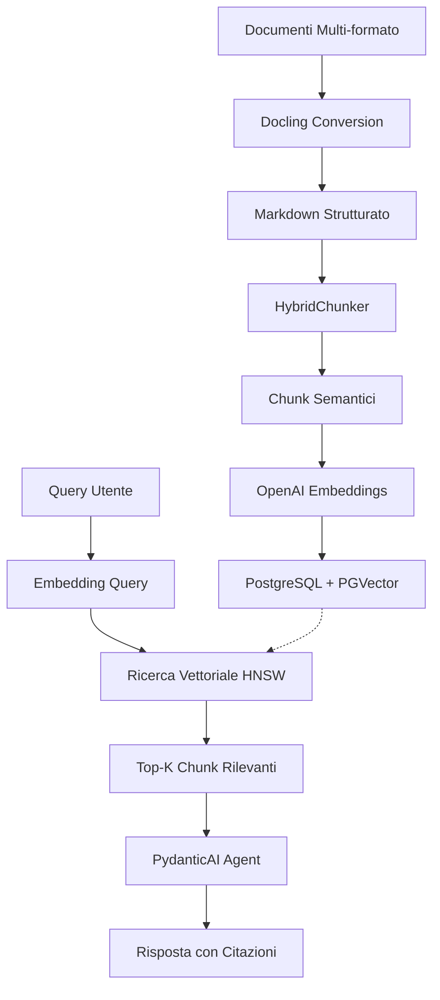

# Analisi Completa: Docling RAG Agent

## Panoramica del Progetto

**Docling RAG Agent** è un sistema avanzato di **Retrieval Augmented Generation (RAG)** progettato per fornire accesso conversazionale intelligente a knowledge base documentali. Il sistema combina tecnologie all'avanguardia per trasformare documenti statici in un assistente conversazionale capace di rispondere a domande complesse con citazioni precise delle fonti.

### Cos'è e Cosa Fa

Il sistema permette di:

- **Ingerire documenti** in formati multipli (PDF, Word, PowerPoint, Excel, HTML, Markdown, testo)
- **Convertire automaticamente** i documenti in formato strutturato usando Docling
- **Creare embeddings vettoriali** per ricerca semantica avanzata
- **Rispondere a domande** usando il contesto dei documenti con citazioni delle fonti
- **Filtrare ricerche** per fonti specifiche (es. "cerca solo nella documentazione Docling")
- **Monitorare costi e performance** in tempo reale tramite LangFuse e Prometheus

## Architettura Tecnica

### Componenti Principali

Il sistema è organizzato secondo un'architettura **Service-Oriented Architecture (SOA)** con separazione netta delle responsabilità:

#### 1. **Pipeline di Ingestione** (`ingestion/`)

La pipeline di elaborazione documenti gestisce:

- **Conversione Multi-formato**: Utilizza Docling per convertire PDF, DOCX, PPTX, XLSX, HTML, MD, TXT in Markdown strutturato
- **Chunking Intelligente**: Implementa `HybridChunker` di Docling che:
  - Rispetta i confini semantici (paragrafi, sezioni, tabelle)
  - Preserva la struttura del documento (gerarchia dei titoli)
  - Usa token-aware chunking (non stime basate su caratteri)
  - Include contesto contestuale nei chunk (titoli padre)
- **Generazione Embeddings**: Crea embeddings vettoriali a 1536 dimensioni usando OpenAI `text-embedding-3-small`
- **Caching LRU**: Cache persistente con 2000 entry per ridurre chiamate API del 60-70%

#### 2. **Core RAG Service** (`core/`)

Il cuore del sistema contiene:

- **`rag_service.py`**: Logica RAG pura, disaccoppiata da UI e framework
  - Ricerca vettoriale con similarità coseno
  - Filtraggio per fonte documentale
  - Timing breakdown dettagliato (embedding, DB, totale)
- **`agent.py`**: Wrapper PydanticAI per integrazione Streamlit
  - Gestione conversazione con cronologia
  - Tool `search_knowledge_base` con filtraggio intelligente

#### 3. **MCP Server** (`docling_mcp/`)

Server Model Context Protocol standalone per integrazione con Cursor IDE e Claude Desktop:

- **Architettura Standalone**: Integrazione diretta con `core/rag_service.py` (no HTTP overhead)
- **Tools Disponibili**:
  - `query_knowledge_base`: Ricerca semantica con filtri opzionali
  - `ask_knowledge_base`: Domande dirette con risposte contestuali
  - `list_knowledge_base_documents`: Lista documenti disponibili
  - `get_knowledge_base_document`: Recupero documento completo
  - `get_knowledge_base_overview`: Panoramica statistica della knowledge base
- **Observability Integrata**: Tracing LangFuse automatico con cost tracking
- **Metriche Prometheus**: Endpoint `/metrics` e `/health` per monitoring

#### 4. **Interfaccia Streamlit** (`app.py`)

Interfaccia web moderna con:

- Chat interattiva con cronologia persistente
- Streaming real-time delle risposte (token-per-token)
- Statistiche sessione (query count, costi, latenza media)
- Integrazione LangFuse per tracing completo
- Session tracking con persistenza PostgreSQL

#### 5. **Database PostgreSQL + PGVector**

Architettura dati ottimizzata:

- **Schema**:
  - `documents`: Metadati documenti (id, title, source, content, metadata)
  - `chunks`: Chunk di testo con embeddings vettoriali (vector(1536))
  - `sessions`: Tracking sessioni Streamlit (query_count, total_cost, avg_latency)
  - `query_logs`: Logging query con costi e timing
- **Indici Ottimizzati**:
  - **HNSW Index**: Indice vettoriale ad alte prestazioni (10-100x più veloce di IVFFlat)
    - Parametri: `m=16`, `ef_construction=64`
    - Performance: 20-60ms per ricerca vettoriale (vs 100-300ms con IVFFlat)
  - Indici B-tree per filtri su `source`, `document_id`, `session_id`
- **Funzione SQL**: `match_chunks()` per ricerca similarità vettoriale con soglia configurabile

### Flusso di Elaborazione

## Tecnologie Utilizzate

### Stack Tecnologico

| Categoria               | Tecnologia | Versione | Scopo                             |
| ----------------------- | ---------- | -------- | --------------------------------- |
| **Linguaggio**          | Python     | 3.11+    | Runtime principale                |
| **Package Manager**     | UV         | 0.9.13+  | Gestione dipendenze veloce        |
| **Database**            | PostgreSQL | 16+      | Storage relazionale               |
| **Vector DB**           | PGVector   | 0.8.0+   | Ricerca vettoriale                |
| **LLM Provider**        | OpenAI     | 2.8.1+   | GPT-4o-mini per generazione       |
| **Embeddings**          | OpenAI     | 2.8.1+   | text-embedding-3-small (1536 dim) |
| **UI Framework**        | Streamlit  | 1.31+    | Interfaccia web chat              |
| **MCP Framework**       | FastMCP    | 0.4.x+   | Server MCP standalone             |
| **Agent Framework**     | PydanticAI | 0.7.4+   | LLM agent con tool calling        |
| **Document Processing** | Docling    | 2.55+    | Conversione multi-formato         |
| **Observability**       | LangFuse   | 3.0.0+   | Tracing e cost tracking           |
| **Metrics**             | Prometheus | -        | Metriche performance              |
| **Testing**             | pytest     | 8.x+     | Framework testing                 |
| **E2E Testing**         | Playwright | 1.40.0+  | Test end-to-end                   |

### Scelte Architetturali Chiave

1. **Service-Oriented Architecture**: Separazione netta tra business logic (`core/`), UI (`app.py`), e servizi (`docling_mcp/`)
2. **Direct Service Integration**: MCP server usa direttamente `core/rag_service.py` (no HTTP overhead)
3. **Global Embedder Singleton**: Istanza embedder condivisa con cache persistente (elimina 300-500ms overhead per query)
4. **HNSW Vector Index**: Indice vettoriale ottimizzato per performance consistenti anche con dataset grandi
5. **Decorator-Based Observability**: Pattern `@observe()` di LangFuse per tracing automatico con graceful degradation

## Punti di Forza

### 1. **Performance Ottimizzate**

- **HNSW Index**: Ricerca vettoriale 10-100x più veloce rispetto a IVFFlat
  - Query media: **1395ms** (vs 3563ms prima)
  - Query con cache: **237ms** (vs 298ms prima)
  - Ricerca DB: **20-60ms** (vs 100-300ms prima)
- **Global Embedder**: Eliminato overhead 300-500ms per query
- **Connection Pooling**: Pool ottimizzato (2-10 connessioni) con prepared statements caching
- **Embedding Cache**: Cache LRU con 2000 entry, hit rate ~66%

### 2. **Elaborazione Documenti Avanzata**

- **Multi-formato**: Supporto nativo per PDF, Word, PowerPoint, Excel, HTML, Markdown, testo
- **Chunking Intelligente**: `HybridChunker` di Docling preserva struttura e confini semantici
- **Token-Aware**: Chunking basato su token reali, non stime caratteri
- **Contesto Preservato**: Chunk includono gerarchia titoli per migliore contesto RAG

### 3. **Observability Completa**

- **LangFuse Integration**: Tracing automatico con cost tracking integrato
  - Cost breakdown automatico (embedding + LLM)
  - Timing breakdown per componente (embedding, DB, LLM)
  - Nested spans per granularità completa
- **Prometheus Metrics**: Metriche standard per monitoring produzione
  - `mcp_requests_total`: Contatore richieste per tool e status
  - `mcp_request_duration_seconds`: Latenza richieste (histogram SLO-aligned)
  - `rag_embedding_time_seconds`: Tempo generazione embedding
  - `rag_db_search_time_seconds`: Tempo ricerca database
- **Health Check**: Endpoint `/health` con status servizi (ok/degraded/down)

### 4. **Filtraggio Intelligente**

- **Source Filtering**: Ricerca mirata per fonti specifiche
  - Esempio: "Cerca solo nella documentazione Docling" → filtra automaticamente su `source_filter="docling"`
  - Pattern matching flessibile per percorsi parziali
  - Zero contaminazione tra documentazioni diverse

### 5. **Architettura Production-Ready**

- **Error Handling**: Pattern `ToolError` per errori user-facing, graceful degradation
- **Retry Logic**: Exponential backoff con `tenacity` (max 3 tentativi)
- **Connection Pooling**: Gestione ottimizzata connessioni database
- **Session Tracking**: Persistenza sessioni con statistiche (query count, costi, latenza)
- **CI/CD Pipeline**: GitHub Actions con lint, type-check, test, secret scanning
- **Code Quality**: CodeRabbit AI review automatica, coverage >70% enforcement

### 6. **Integrazione MCP**

- **Standalone Server**: Nessuna dipendenza esterna, integrazione diretta
- **Cursor IDE Compatible**: Integrazione nativa con Cursor per accesso knowledge base
- **Claude Desktop Support**: Compatibile con Claude Desktop MCP
- **Tools Completi**: Set completo di tool per query, listing, overview

### 7. **Documentazione Completa**

- **Architecture Docs**: Documentazione architettura completa con ADR
- **Coding Standards**: Guide stile codice e best practices
- **Testing Strategy**: Strategia testing con TDD, RAGAS evaluation
- **Development Guide**: Setup e workflow sviluppo
- **API Reference**: Documentazione API completa (MkDocs)

## Punti di Debolezza e Aree di Miglioramento

### 1. **Dipendenze Esterne**

- **OpenAI API**: Dipendenza critica per embeddings e LLM
  - **Impatto**: Costi operativi, latenza API esterna, rate limits
  - **Miglioramento**: Supporto per modelli locali (Ollama, vLLM) o self-hosted embeddings
- **PostgreSQL Requisito**: Richiede setup PostgreSQL con PGVector
  - **Impatto**: Complessità setup per nuovi utenti
  - **Miglioramento**: Docker Compose completo con PostgreSQL incluso, o supporto per database alternativi (Qdrant, Weaviate)

### 2. **Scalabilità Orizzontale**

- **Architettura Attuale**: Singleton embedder, connection pool per processo
  - **Limite**: Scalabilità verticale principalmente
  - **Miglioramento**: Supporto per embedding service esterno, load balancing per MCP server

### 3. **Costi Operativi**

- **OpenAI API**: Costi per embeddings e LLM generation
  - **Embedding**: $0.00002/1K tokens (text-embedding-3-small)
  - **LLM**: $0.00015/1K tokens input, $0.0006/1K tokens output (gpt-4o-mini)
  - **Miglioramento**:
    - Cache più aggressiva per query frequenti
    - Supporto modelli più economici (es. gpt-3.5-turbo)
    - Batch processing per embeddings durante ingestione

### 4. **Sicurezza**

- **Autenticazione**: Nessuna autenticazione utente implementata
  - **Impatto**: Accesso non controllato alla knowledge base
  - **Miglioramento**:
    - Autenticazione Streamlit opzionale (già prevista in `utils/streamlit_auth.py`)
    - Rate limiting per utente (già previsto in `utils/rate_limiter.py`)
    - Cost limits per sessione (già previsto in `utils/cost_monitor.py`)

### 5. **Testing Coverage**

- **Coverage Attuale**: Target >70%, ma alcuni moduli potrebbero essere sotto
  - **Miglioramento**:
    - Aumentare coverage unit tests per `core/rag_service.py`
    - Aggiungere integration tests per MCP server
    - E2E tests più completi con Playwright

### 6. **Documentazione Utente**

- **Documentazione Tecnica**: Eccellente per sviluppatori
- **Documentazione Utente**: Potrebbe essere migliorata
  - **Miglioramento**:
    - Guide utente passo-passo per setup iniziale
    - Video tutorial per ingestione documenti
    - FAQ per troubleshooting comune

### 7. **Multi-tenancy**

- **Architettura Attuale**: Single-tenant (una knowledge base per istanza)
  - **Limite**: Non supporta multiple organizzazioni/utenti separati
  - **Miglioramento**:
    - Schema multi-tenant con `tenant_id` nelle tabelle
    - Isolamento dati per tenant
    - Quotas per tenant

## Casi d'Uso

### 1. **Knowledge Base Aziendale**

- **Scenario**: Azienda con documentazione tecnica, policy, procedure
- **Benefici**:
  - Ricerca semantica invece di keyword search
  - Risposte contestuali con citazioni precise
  - Filtraggio per tipo documento (es. "solo policy HR")

### 2. **Assistenza Clienti**

- **Scenario**: Knowledge base prodotti/servizi per supporto clienti
- **Benefici**:
  - Risposte immediate a domande frequenti
  - Citazioni per verificabilità
  - Aggiornamento continuo con nuovi documenti

### 3. **Ricerca Accademica**

- **Scenario**: Ricercatore che analizza paper scientifici
- **Benefici**:
  - Ricerca semantica su corpus di paper
  - Citazioni precise per riferimenti
  - Filtraggio per autore, anno, argomento

### 4. **Documentazione Software**

- **Scenario**: Team sviluppo con documentazione API, guide, changelog
- **Benefici**:
  - Ricerca rapida nella documentazione
  - Risposte contestuali con esempi codice
  - Filtraggio per versione API o componente

### 5. **Integrazione IDE**

- **Scenario**: Sviluppatore che usa Cursor IDE con accesso a knowledge base
- **Benefici**:
  - Query knowledge base direttamente da IDE
  - Context injection per AI coding assistant
  - Ricerca documentazione durante sviluppo

## Conclusioni

**Docling RAG Agent** rappresenta un'implementazione **production-ready** di un sistema RAG completo, con architettura ben progettata, performance ottimizzate, e observability integrata. Il sistema dimostra best practices per:

- **Separazione delle responsabilità**: Architettura SOA con core logic disaccoppiata
- **Performance**: Ottimizzazioni HNSW, caching, connection pooling
- **Observability**: Tracing completo con LangFuse e metriche Prometheus
- **Developer Experience**: Documentazione completa, CI/CD, code quality enforcement

Le aree di miglioramento identificate (multi-tenancy, modelli locali, scalabilità orizzontale) rappresentano evoluzioni naturali per un sistema già solido, piuttosto che limitazioni critiche.

Il progetto è particolarmente adatto per:

- **Aziende** che vogliono democratizzare l'accesso alla knowledge base
- **Team sviluppo** che necessitano ricerca intelligente nella documentazione
- **Progetti** che richiedono citazioni precise e tracciabilità delle fonti
- **Integrazioni** con IDE moderni per context-aware development

---

**Versione Documento**: 1.0  
**Data**: 2025-01-27  
**Autore**: Analisi Tecnica Completa
